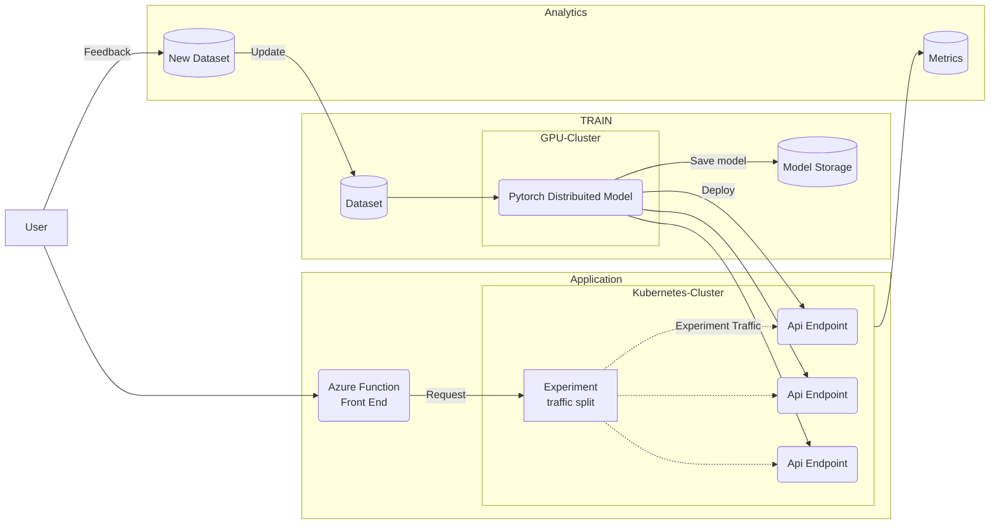

# Intro

## Architecture

```mermaid
    graph LR;

        subgraph TRAIN
            direction LR;
            DataSet[(Dataset)] --> PytorchModel
            subgraph GPU-Cluster
                PytorchModel(Pytorch Distribuited Model)
            end
            PytorchModel -->|Save model| ModelStorage[(Model Storage)]
        end


        subgraph Application        
            subgraph Kubernetes-Cluster
                PytorchModel -->|Deploy| API1(Api Endpoint)
                PytorchModel --> API2(Api Endpoint)
                PytorchModel --> API3(Api Endpoint)
                TrafficExperimentSplit -.->|Experiment Traffic| API1
                TrafficExperimentSplit -.-> API2
                TrafficExperimentSplit -.-> API3
            end
            AzureFrontEnd(Azure Function \n Front End) -->|Request| TrafficExperimentSplit[Experiment \n traffic split]
        end

        subgraph Analytics
            Kubernetes-Cluster --> MetricDataStore[(Metrics)]
            NewDataSet[(New Dataset)]
        end
        User --> AzureFrontEnd
        User -->|Feedback| NewDataSet
        NewDataSet -->|Update| DataSet
```